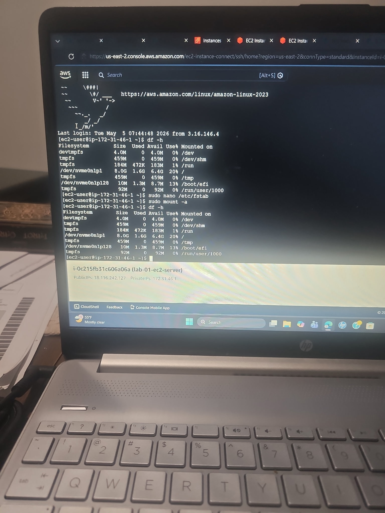
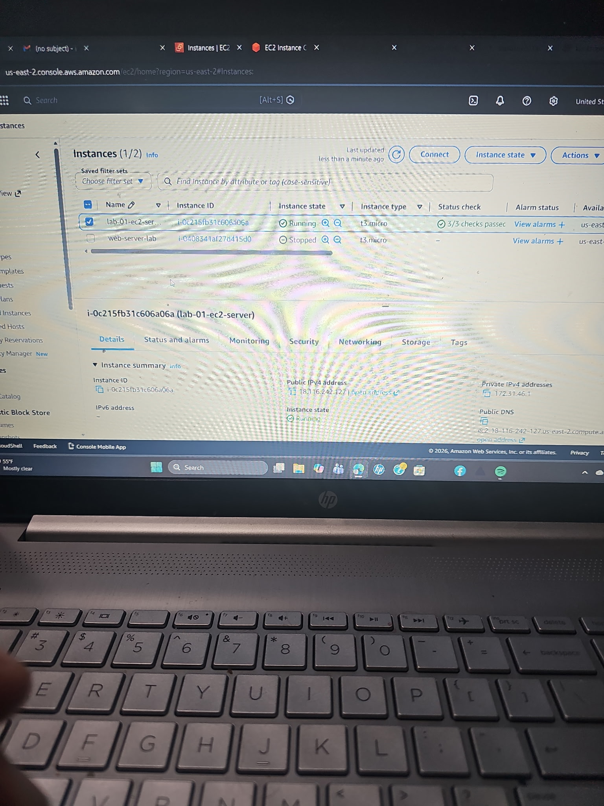

# JGarcia6783ecsljp-aws-lab-08-ec2-ebs-persistent-storage
AWS EC2 and Elastic Block Store persistent storage deployment with Linux filesystem mounting, fstab configuration, reboot persistence testing, and volume validation.

## Screenshots

### EC2 Instance Running

### EBS Mount Validation

### Persistent Storage Validation

